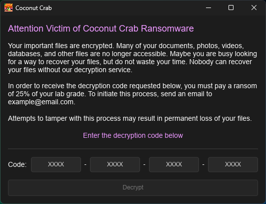

# Coconut Crab

<div align="left">
  
</div>

# Description

## Overview

This is client (coconut_crab_client) / server (coconut_crab_server) application built in Rust to simulate a ransomware attack.

**This software is indended for use in education only and should not be used for harm.**

The following additional applications are included:

- **group_docx_tool** - A tool to create and verify the authenticity of DOCX files for groups

### Communication

The following HTTPS requests are sent in sequence:

1. **Download** - Client downloads the asymmetric public key
2. **Registration** - Client uploads ID and hostname
3. **Symmetric Key Upload** - Client uploads asymmetrically encrypted symmetric key
4. **Symmetric Key Recovery** - Client requests symmetric key due to premature end (if not completed and within accepted time period)
5. **Completion Announcement** - Client announces that it has completed the encryption process
6. **Symmetric Key Download** - Client provides a decryption code and downloads symmetric key

### Encryption Pipeline

The client performs the following steps to encrypt a file:

1. Walk the filesystem
2. Analyze files to avoid canaries (optional)
3. Create a new encrypted file
4. Overwrite and delete the existing plaintext file

### Client GUI

<div align="left">
  
</div>

## Features

- Does not run unless the server can be reached for sandboxing
- Analyze mode to list files without encrypting them
- Configurable victim GUI accepting code for decryption
- Configurable TLS encryption in transit
- Configurable to be flawed and generate artifacts for detection
- Configurable allow and block lists of file extensions and paths
- Configurable encryption delay time and jitter
- Configurable canary avoidance
  - Analyzes PDF and Office / zip files
  - Avoids hidden directories and files
  - Identifies keywords
  - Identifies non-default URLs
  - Identifies broken images
- Configurable persistence through a registry entry
- Configurable setting of desktop wallpaper
- Implements a logging crate with optional verbose output
- Pretty looking and self contained Windows executables
- All persistent application information is stored in a CSV for simple viewing and modification
- Parallel optimized filesystem walking via [zlob](https://github.com/dmtrKovalenko/zlob)
- Reaps benefits being written largely in Rust including
  - AV detection and RE are more difficult
  - Speed and parallelism
  - Memory safety without garbage collection
  - Cross-platform

## Considerations

As this is an application for education and not real-world use, there were several compromises made to the design including the following:

- A baked in litcrypt secret is used for request validation and is shared by every client
- Every request sent to the server is HMAC-SHA256 keyed with the secret for validation
  - The server does not implement a rate limit itself (DoS)
  - The server is not resistant to replay attacks
- By default, the application is configured to use publicly known RSA key pairs for encryption
- By default, the application is configured not to validate HTTPS certificates
- By default, the public key is written to the victim hard drive
- The client requests a public key from the server before it can begin (creating artifacts for students)
- Files are encrypted with a single ChaCha20-Poly1305 AEAD operation per file rather than a streaming chunked format
  - This keeps the on-disk format simple for students to determine, but requires the entire file to be buffered in memory

**I am not a software engineer and this was my first time with Rust. Beware of data loss!**

# Usage

## Configuration

### Client Configuration

Client configuration variables are in `coconut_crab_client/src/config.rs`

Variable | Type | Summary
--- | --- | ---
SERVER_PORT | u16 | remote web server port (must match server)
SERVER_FQDN | LazyLock\<String\> | remote web server hostname or IP address
ALLOWLIST_PATHS | LazyLock\<Vec\<PathBuf\>\> | paths to target
BLOCKLIST_PATHS | Option\<Vec\<PathBuf\>\> | paths to avoid (optional)
ALLOWLIST_EXTENSIONS | LazyLock\<Vec\<String\>\> | file extensions to target (optional)
BLOCKLIST_EXTENSIONS | Option\<Vec\<String\>\> | file extensions to avoid (optional)
ENCRYPTED_EXTENSION | LazyLock\<String\> | file extension applied to encrypted files
SAVE_PUBLIC_KEY_TO_DISK | bool | should client save public encryption key to disk
SET_WALLPAPER | bool | should the client set desktop wallpaper to the application icon
HTTPS | bool | should the client use HTTP or HTTPS with TLS
VERIFY_SERVER | bool | should the client validate HTTPS certificates
ANALYZE_MODE | bool | should files be logged instead of encrypted
PERSIST | bool | should a registry startup entry be created
AVOID_HIDDEN | bool | should the client avoid hidden directories and files
AVOID_URLS | bool | should client avoid URLs that do not occur natively in Office files
AVOID_KEYWORDS | bool | should client avoid keywords associated with canary files
AVOID_BROKEN_IMAGES | bool | should client avoid images that cannot be rendered correctly
ANALYZE_OFFICE_ZIP | bool | should client analyze office and zip files for canaries
ANALYZE_PDF | bool | should client analyze pdf files for canaries
RANDOM_ORDER | bool | should client randomize the order that files are encrypted
WAIT_TIME | u32 | time to wait between file encryptions (set to 0 for no delay)
JITTER_TIME | u32 | time variance applied to wait_time
PRESHARED_SECRET | LazyLock\<String\> | code used to validate web requests (must match server)

GUI text can be configured in `coconut_crab_client/ui/main.slint`

The application icon is placed in `coconut_crab_client/assets/img/`

EXE properties can be configured under in `coconut_crab_client/Cargo.toml`

Persistent client variables can be found in the `status.csv` generated by the executable

### Server Configuration

Server configuration variables are in `coconut_crab_server/src/config.rs`

Variable | Summary
--- | ---
PORT | web server port (must match client)
HTTPS | whether the web server should use HTTP or HTTPS with TLS
RECOVERY_WINDOW_SECONDS | time period that a symmetric key can be recovered if lost by client
PRESHARED_SECRET | code used to validate web requests (must match client)
BYPASS_CODE | code used to unlock decryption on any victim

Victim records are stored in the `victims.db` database file created in the executable directory on startup

## Compilation

### Setup Windows for Compilation

1. Download and install [rustup](https://static.rust-lang.org/rustup/dist/x86_64-pc-windows-msvc/rustup-init.exe)
2. Download and install [cmake](https://cmake.org/download/)
3. Download and install [Zig](https://ziglang.org/download/)

### Setup Ubuntu for Compilation

```bash
sudo apt update
sudo apt install build-essential pkg-config mingw-w64 cmake zig
curl --proto '=https' --tlsv1.3 https://sh.rustup.rs -sSf | sh
source $HOME/.cargo/env
rustup target add x86_64-pc-windows-gnu
```

### Configure HTTPS Certificates

HTTPS certificates are placed in the following paths:

- `coconut_crab_lib/assets/cert/ca-cert.pem`
- `coconut_crab_lib/assets/cert/cert.pem`
- `coconut_crab_lib/assets/cert/key.pem`

Example HTTPS certificate generation:

```bash
openssl req -x509 -newkey rsa:4096 -keyout ca-key.pem -out ca-cert.pem -sha256 -days 3650 -nodes -config ./ca-cert.cnf
openssl req -newkey rsa:4096 -nodes -keyout key.pem -out server.csr -config ./cert.cnf
openssl x509 -req -in server.csr -CA ca-cert.pem -CAkey ca-key.pem -CAcreateserial -out cert.pem -days 3650 -sha256 -extfile cert.ext
```

- See `coconut_crab_lib/assets/cert/ca-cert.cnf`, `coconut_crab_lib/assets/cert/cert.cnf`, and `coconut_crab_lib/assets/cert/cert.ext` for example configuration and extension files

### Configure Encryption Certificates

Encryption certificates are placed in the following paths:

- `coconut_crab_server/assets/public/asym-pub-key.pem`
- `coconut_crab_server/assets/private/asym-priv-key.pem`

Example encryption certificate generation:

```bash
openssl genrsa -out private.pem 2048
openssl rsa -in private.pem -pubout -out public.pem
openssl rsa -in private.pem -out private_pkcs1.pem -traditional
openssl rsa -pubin -in public.pem -RSAPublicKey_out -out public_pkcs1.pem -traditional
```

# Support

If you have any issues with this application, feel free to reach out to [Michael Jenkins](https://jenkinsmichpa.com).

# Authors and Acknowledgement

This project was developed by [Michael Jenkins](https://jenkinsmichpa.com) with the help of [Samuel Ho](mailto:ho176@purdue.edu) for use in teaching Purdue CNIT 47000 - Incident Response Management.

# License

This project is licensed with the MIT License.
